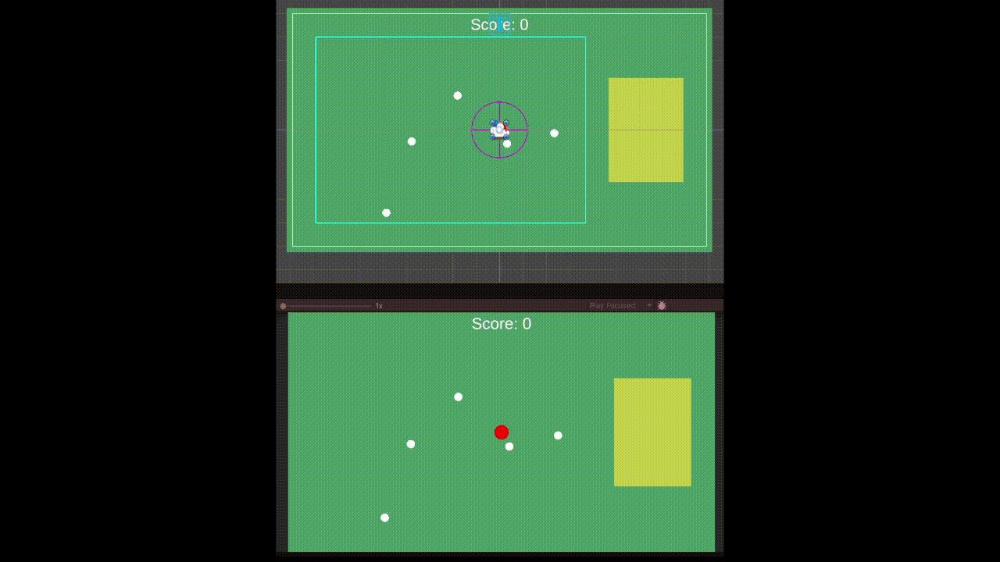

# 🧠 Top-Down Herd Prototype (Unity)

  

---

## 🎯 Overview

A small 2D top-down prototype built in Unity demonstrating clean architecture, scalable systems, and gameplay fundamentals.

The player controls a hero by clicking on the ground, collects animals into a herd, and delivers them to a yard to gain score.

> ⚠️ This project focuses on **architecture and code quality**, not visuals.

---

## 🎮 Gameplay

- Click anywhere → Hero moves to target position  
- Animals patrol randomly within a defined area  
- Hero collects animals within radius  
- Max **5 animals** follow the hero  
- Animals form a **chain (follow system)**  
- Deliver animals to the **Yard Zone**  
- Score increases per delivered animal  

---

## 🧱 Architecture

### Core Principle

MonoBehaviour → View / Entry point  
Pure C# classes → Logic / Services  

---

### Systems Overview

- GameBootstrapper — manual dependency injection  
- InputService — input abstraction  
- HeroController / HeroMover — player movement  
- AnimalController — entry point for animal logic  
- AnimalStateMachine — state logic  
- HerdService — manages collected animals  
- DeliveryService — handles delivery  
- ScoreService — score logic + events  
- AnimalSpawner — spawning system  
- AnimalPool — object reuse  

---

## 🧠 Patterns Used

### State Pattern
Animals use states:
- Patrol  
- FollowHero  

### Observer Pattern
ScoreService → ScoreView  

### Service Pattern
- HerdService  
- ScoreService  
- InputService  

### Object Pool
Avoids Instantiate/Destroy during gameplay.

### Manual Dependency Injection
All dependencies are wired in GameBootstrapper.

---

## 🌍 Adaptive World System

- Camera adapts to screen size  
- Ground scales to fill visible area  
- SpawnArea dynamically adjusts  
- YardZone always positioned on the right  

---

## ⚙️ Performance Decisions

- OverlapCircleNonAlloc used to avoid GC  
- Object pooling for animals  
- MoveTowards for stable movement  
- Minimal runtime allocations  

---

## ▶️ How to Run

1. Open MainScene  
2. Press Play  

---

## 📦 Implemented Features

- Hero movement  
- Animal AI (patrol + follow)  
- Herd system (limit 5)  
- Delivery system  
- Score system  
- Object pooling  
- Adaptive layout  

---

## 💡 Notes

The goal of this project was to demonstrate:

- Clean architecture  
- Separation of concerns  
- Scalable systems  
- Practical use of patterns in Unity  

---

## 👨‍💻 Author

Daniil Pavlenko 
Unity Game Developer
